# 数据结构笔记
## 概述
数据结构：描述数据以怎样的方式表示和存储，由 逻辑 + 物理 两部分组成，逻辑可以理解为代码中的访问逻辑，物理则是指内存中的实际存储、排列方式。

数据结构影响上层算法细节的设计，当选取不同的逻辑结构、物理结构来表示数据时，完成相同任务所设计的算法是不同的，这时就需要我们对不同的方法进行评估和选择，结合实际问题选取最优者。

<!-- 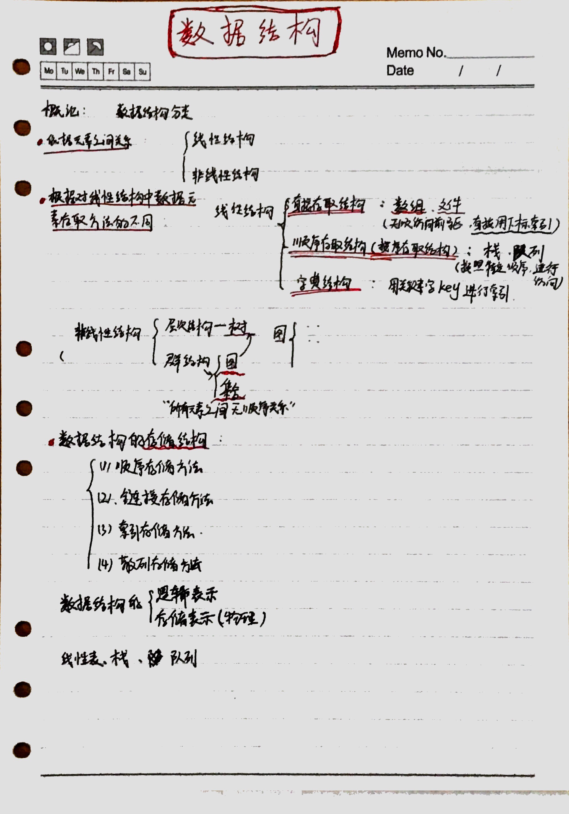 -->

## 基础

<!-- 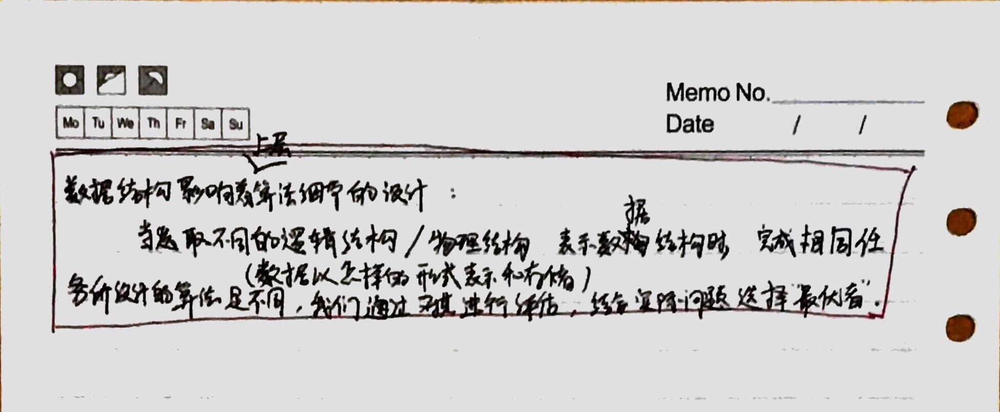 -->
**逻辑结构**：线性表、栈、队列 树

**存储（物理）表示**：数组、链接(链表)

注意逻辑表示和实际物理存储结构之间的区别，例如栈、队列和树。都可以通过数组或者链接来实现，也就是说既可以以顺序存储实现，也可以通过链接存储方式实现。**不同的存储表示方法在数据的访问、插入、删除等操作下，各自具有不同的优势（参考数组与链表的对比，数组在元素索引上方便，但在数据的插入、删除操作上链表更具优势）。**

<!-- 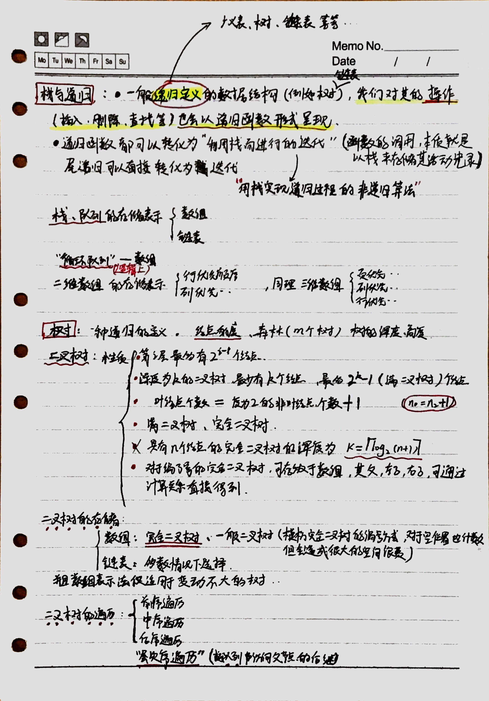 -->

`二叉树`的性质：......

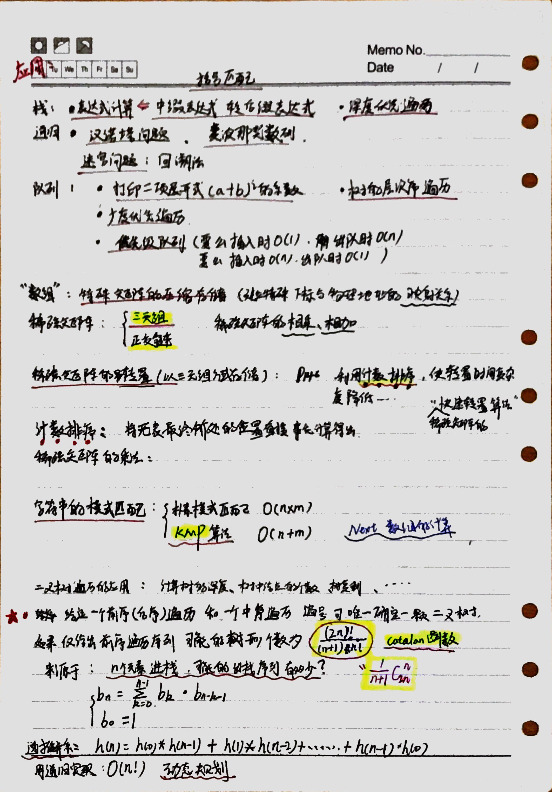

`稀疏矩阵`的表示...
**字符串KMP算法**...
Cotalan数 与 递归 和 动态规划 的关系...

## 非线性结构：
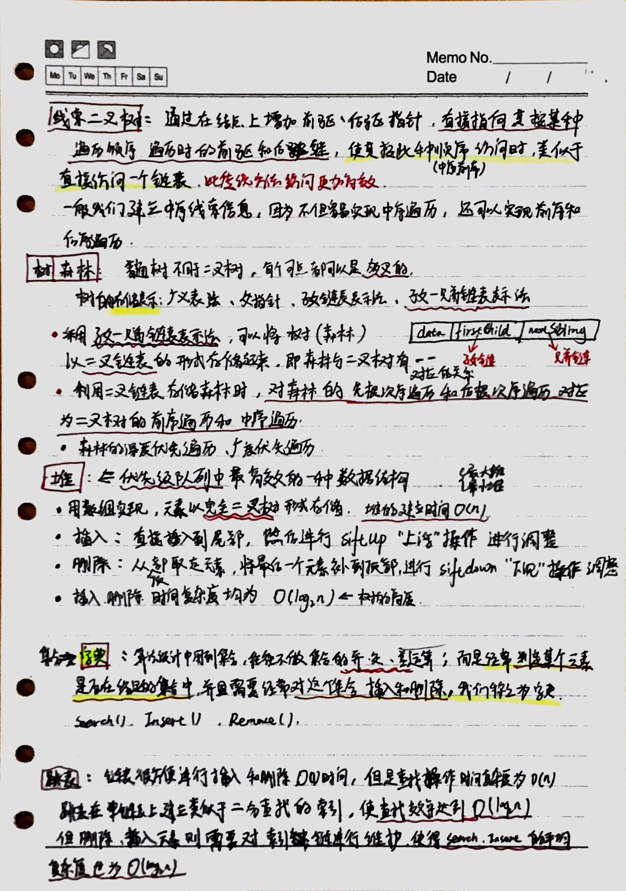

`线索二叉树`：在二叉树基础之上，构建能够快速访问到当前节点的前后节点的结构。在二叉树的不同遍历方法中，**前序遍历**中能直接知道当前节点的下一个访问节点（左子树节点），**后续遍历**中能知道当前节点的上一个访问节点（左子树节点）。

`多叉树` 的存储方式：子女-兄弟链表示法 本质上是一种二叉链的表示方法...
树的先根遍历、后根遍历....

**`最大堆` 的构建、元素插入与删除**....

`跳表`，感觉是一种十分鸡肋的数据结构...

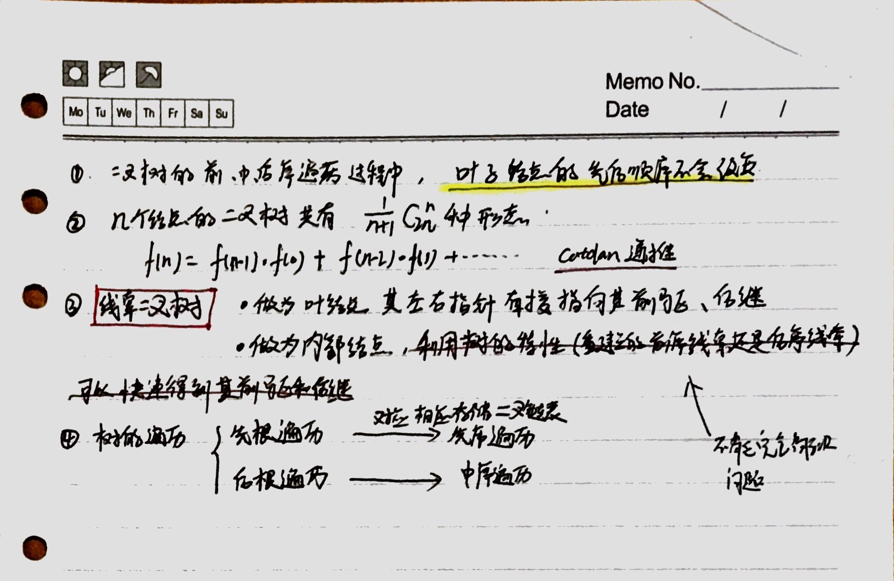

- 二叉树的前中后序遍历过程中，叶子节点的先后顺序不会改变。

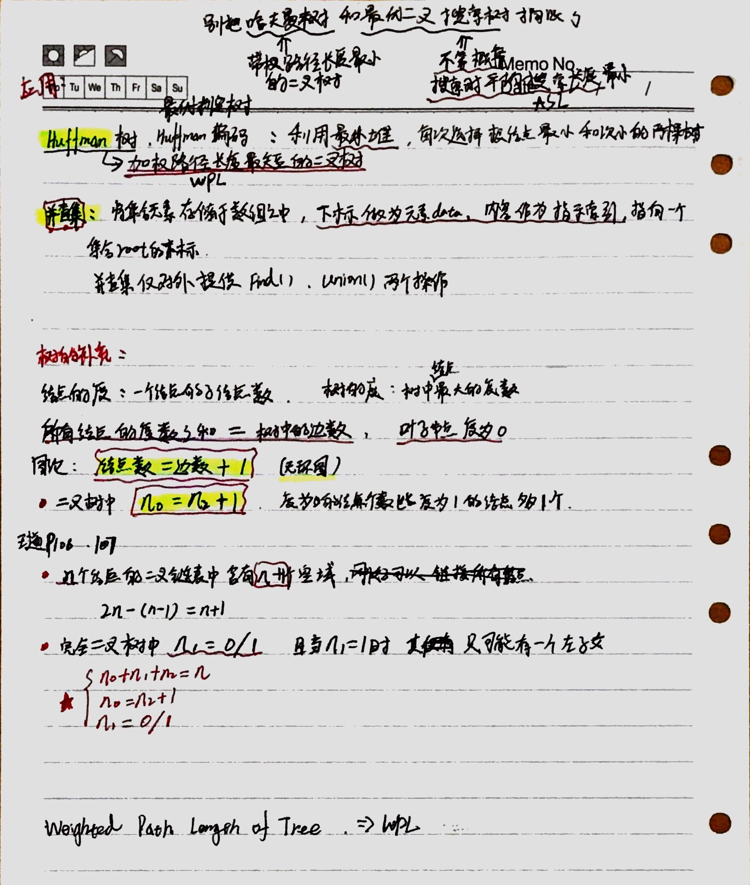

Huffman树：`加权路径最小的二叉树`...

`最优二叉搜索树`：平均搜索长度最小的二叉搜索树，是一种平衡的二叉搜索树

树/图中 节点数、边数、度之间的关系....

## 搜索结构
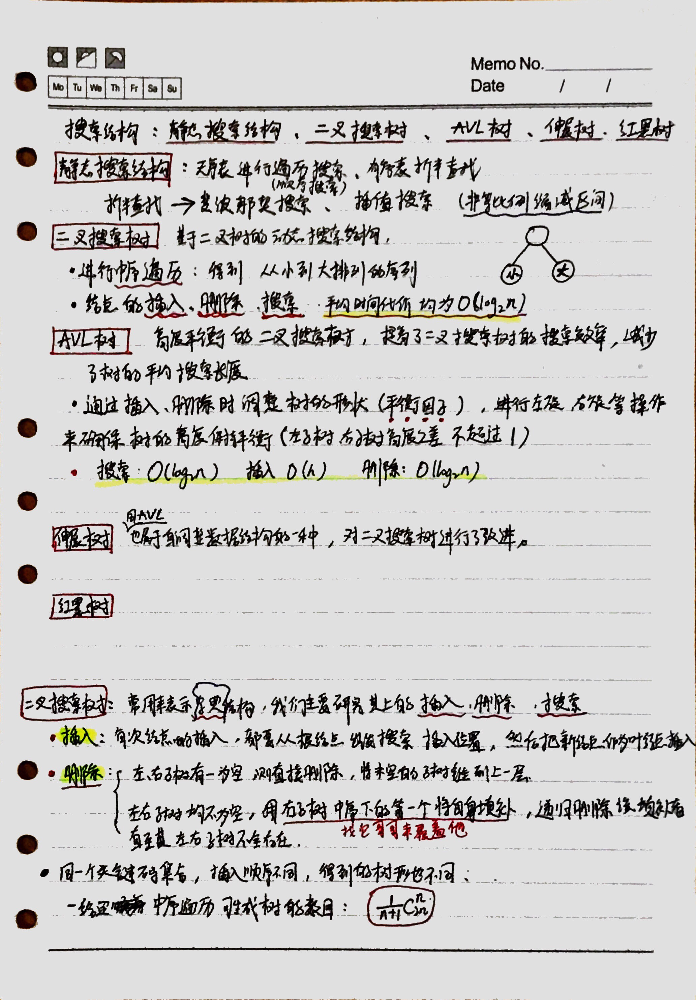

补充：

`AVL树`：平衡的**二叉搜索树**。其在插入、删除数据时，通过规定的“复杂”的节点调整规则来保持树形的平衡。

`红黑树`: 也是一种**二叉搜索树**。其内部将节点标记红、黑两类，通过也定义的节点动态调整规则。红黑树的搜索、插入、删除时间复杂度均为 O(logN)。

在搜索结构中，搜索成功可以发生内部或者叶子节点，但是搜索失败都只能发生在叶子节点（只有到达叶子节点，才能确认搜索失败）。key有N个，则失败的可能情况为N+1种。

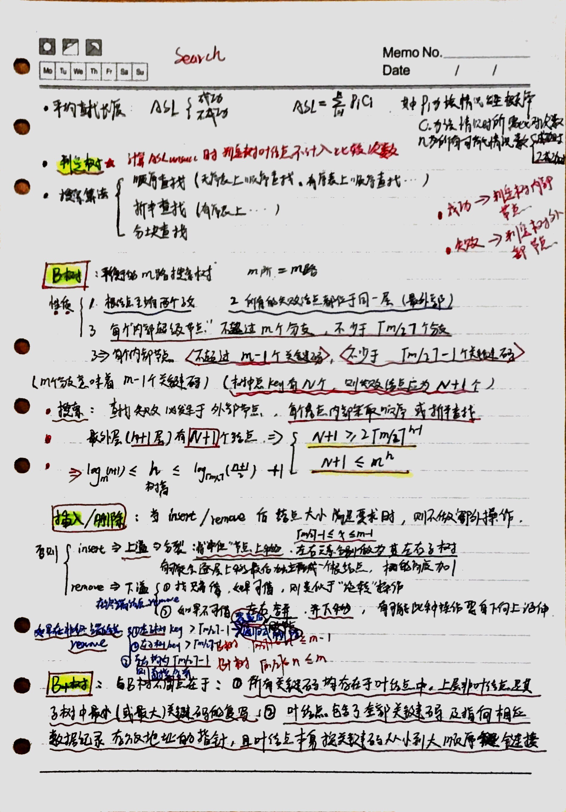
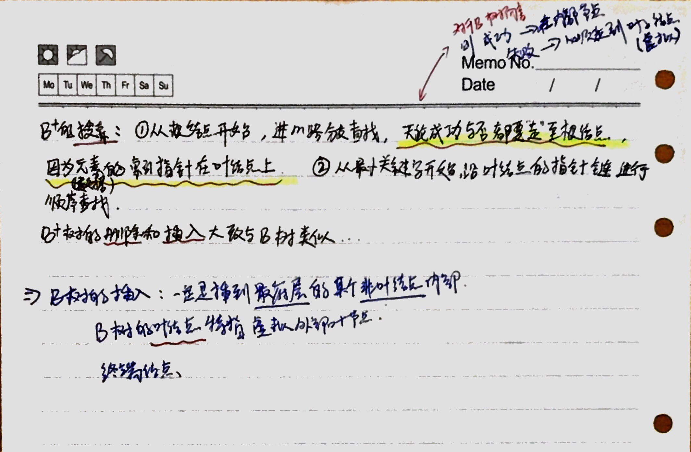

`B 树`：**多路（m路）平衡查找树**。是一种内存中的数据结构，其特点是，每个节点上包含多个元素数值。两个相邻元素限定了一个数值区间，进一步子节点的元素值限定于该元素区间内。
    
    - 每个节点最多有m-1个关键字（可以存有的键值对），根节点最少可以只有1个关键字，非根节点至少有m/2个关键字。
    - 每个节点中的关键字都按照从小到大的顺序排列，每个关键字的左子树中的所有关键字都小于它，而右子树中的所有关键字都大于它。
    - 每个节点都存有索引和数据，也就是对应的key和value。
Insert操作总是发生在叶子上，如果“上溢”则考虑进行节点上移操作。Remove 则有可能发生在内部节点或者叶子节点上。

`B+ 树`：叶子节点存储与磁盘之上。并且为了实现线性遍历访问。

B+树其实和B树是非常相似的，我们首先看看相同点。

    - 根节点至少一个元素，非根节点元素范围：m/2 <= k <= m-1
    - 都是 m 路搜索结构；左节点的索引值小于父节点，右节点索引值大于父节点

不同点：

    - B+树有两种类型的节点：内部结点（也称索引结点）和叶子结点，内部节点就是非叶子节点，内部节点不存储数据只存储索引，数据都存储在叶子节点。
    - B+树种所有的索引都会在叶子节点中出现一次，也就是说内部节点出现过的索引在叶子上仍会出现一次（因为数据在叶子上）。
    - 每个叶子结点都存有相邻叶子结点的指针，叶子结点本身依关键字的大小自小而大顺序链接。所有叶子节点形成一种链式结构。因此，便于进行连续的顺序访问。因此B+树的搜索方式有两种。

`B树` 和 `B+树` 都是为了**外部存储器设计**的数据结构，因为IO的时间消耗远大于内存中的查询，所以两者都是M路结构，通过增加分叉的数量来减少树的高度，这样IO的次数尽可能的会减少。在两种树种，一般都会根据实际情况将节点的大小设置为与每次磁盘IO的数据量之间存在关系的数值上（比如一次IO正好读入若干个节点）。在数据访问速度上，B+树都是要访问至叶子节点才能得到真实的数据，而B树则在内部节点便可能访问到data。因为在B+树中，内部节点只保存索引，所以在检索过程中加载内部节点所花费的IO次数会更少。

**散列结构(Hash Table)**：常用于表示 集合、字典 等数据结构。

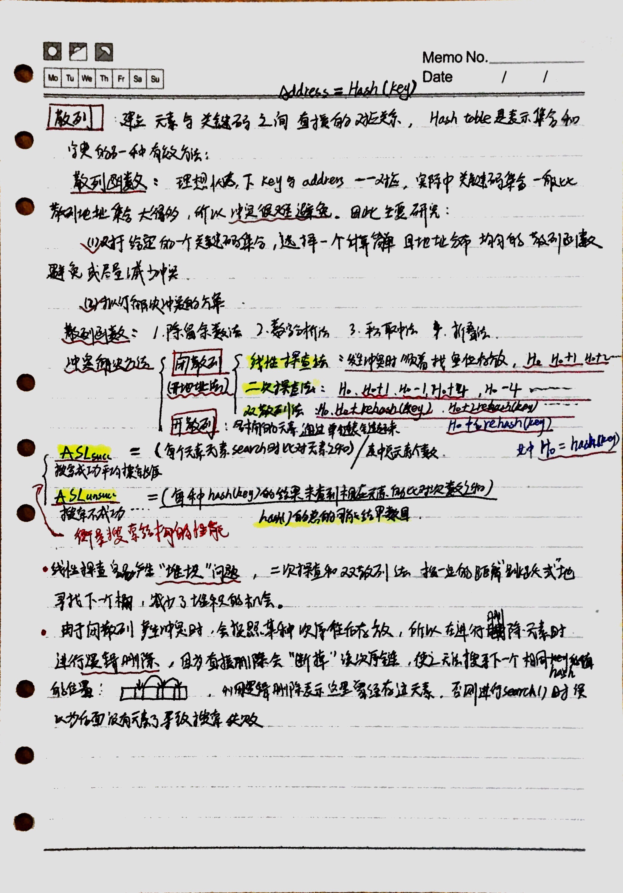

hash冲突解决方法：1）链地址法（开散列）；2）开放地址法（闭散列，其中有三种探查方式）；

桶式散列中，相同桶中的元素的hash值是相同的，通过一个数组保存所有指向桶中的元素。

负载系数 / 加载因子；

## 图
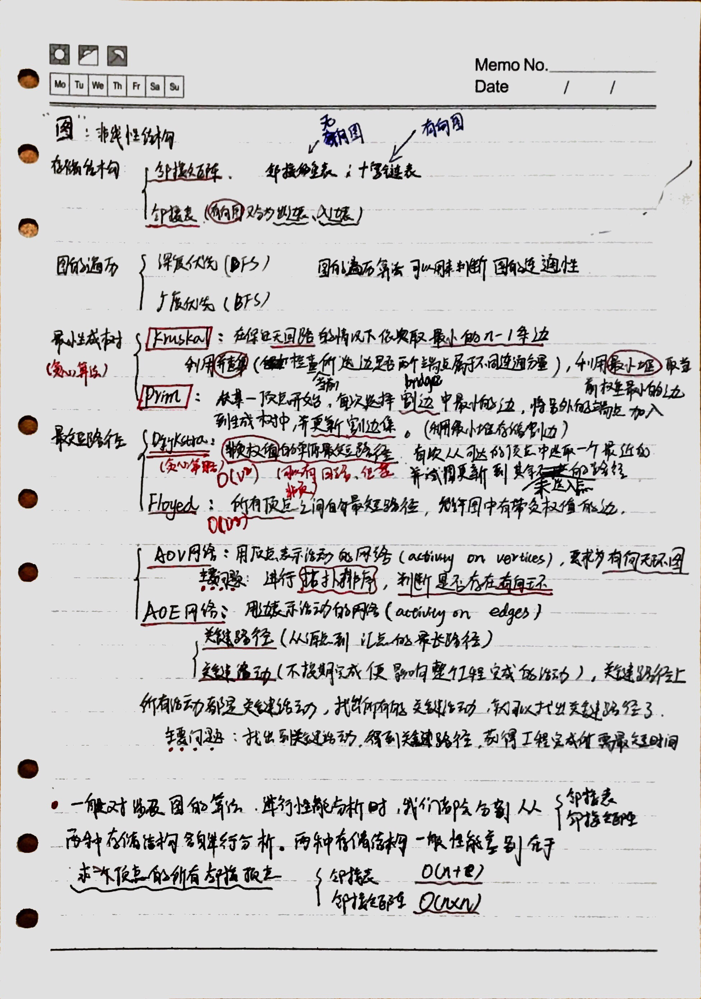

图两种物理表示方法：`邻接矩阵`（快速判断两个节点直接是否相连；），`邻接表`（当邻接矩阵比较稀疏时更适合，因为能够节省空间，但是不适合于稠密图因为大量的指针也会消耗空间存储；） 两者各自有有点。

    - 对于一个具有n个顶点e条边的无向图，它的邻接表表示，有n个顶点表结点2e个边表结点
    - 对于一个具有n个顶点e条边的有向图，它的邻接表表示，有n个顶点表结点e个边表结点
    - 如果图中边的数目远远小于顶点数，称作稀疏图，这是用邻接表表示比用邻接矩阵表示节省空间; 对于无向图接近于n*(n-1)称作稠密图,考虑到邻接表中要附加链域，采用邻接矩阵表示法为宜

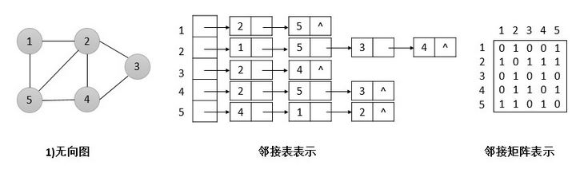

无向图、有向图、边上带权重的图均可以通过这两种方式来表达。对于邻接矩阵而言几种图的表现形式较为统一，对于邻接表而言带权图还需要额外的空间存去权重 [ 链指针，node标记，权重 ]。

- 图中最小生成树算法：`Kruskal` 、`Prim`
- 图中最短路径算法：`Dijkstra` 用于求非负权值单源最短路径，是一种贪心算法，复杂度O(n^2)；`Floyed` 所有顶点之间的最短路径，允许存在负权值，复杂度O(n^3)。

## 排序
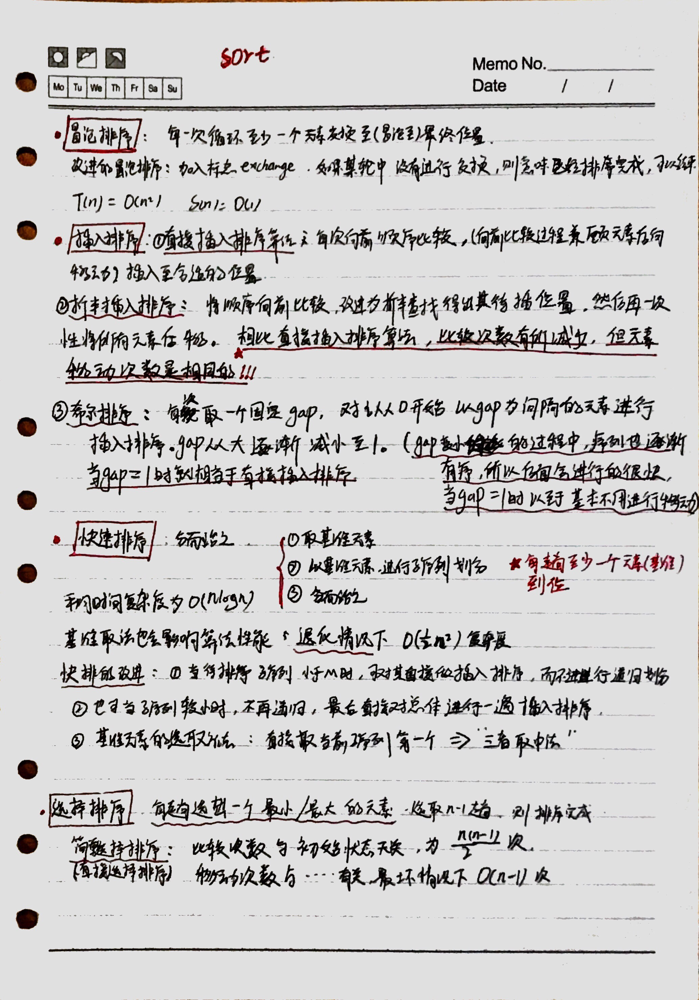
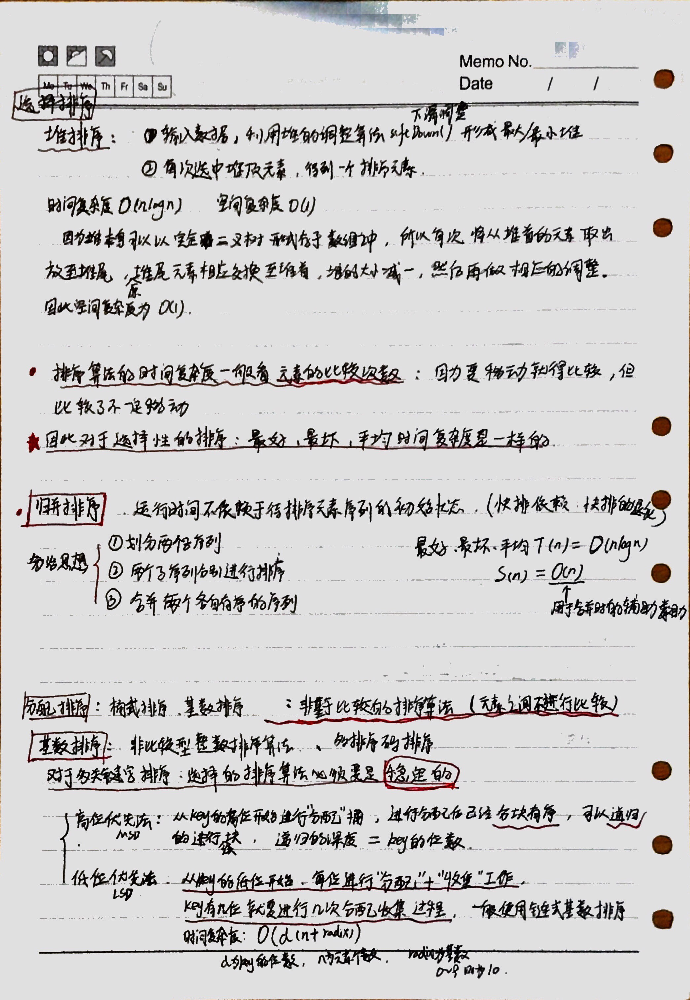

- **快速排序实现** ：1）选基准；2）以基准进行划分（如图所示）；3）递归。

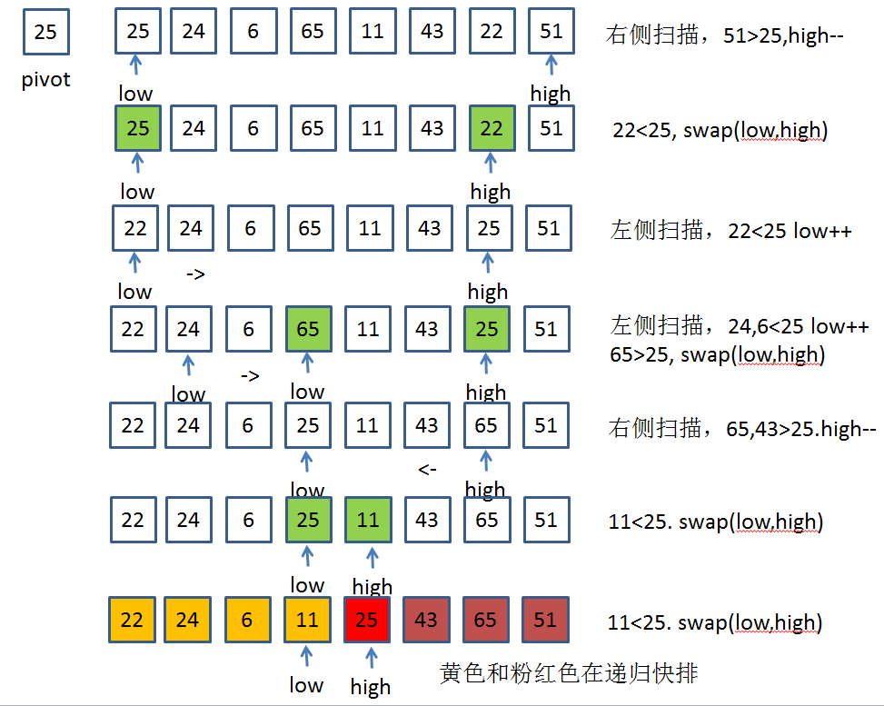
  
- `堆排序` => 堆的构建时间复杂度为 O(nlogn)
  
  1) 自顶向下的建堆方式 : 该建堆方式是从根节点开始，然后一个个的插入堆的末尾，向上进行调整。构建复杂度为 O(nlogn)。
  
  2) O(n) 的建堆过程 ？ 有1/2的元素向下比较了一次，有1/4的向下比较了两次，1/8的，向下比较了3次，......，1/2^k的向下比较了k次。[O(n) 建堆时间复杂度](https://www.zhihu.com/question/20729324/answer/16025846)
   
- 基数排序（高位优先法实际上就是一种桶排序），`桶排序`：先将元素分入到不同的桶（区间）中，然后再对桶内的元素进行排序（选择一种排序算法即可），元素映射入桶的过程比较关键（如何设计合理的桶），尽可能让最后每个桶中的元素数目近似。如果待排序集合中每一个元素值映射到一个桶上，则桶排序向`计数排序`方式演化。

- `计数排序`不是基于比较的排序算法，记录每个下标对应数值出现的次数，最后直接统计出每个元素最后的正确排序的结果位置。时间复杂度O(N)，空间复杂度 O(max value)。有两个前提需要满足：一是需要排序的元素必须是整数，二是排序元素的取值要在一定范围内，并且比较集中。

## 补充
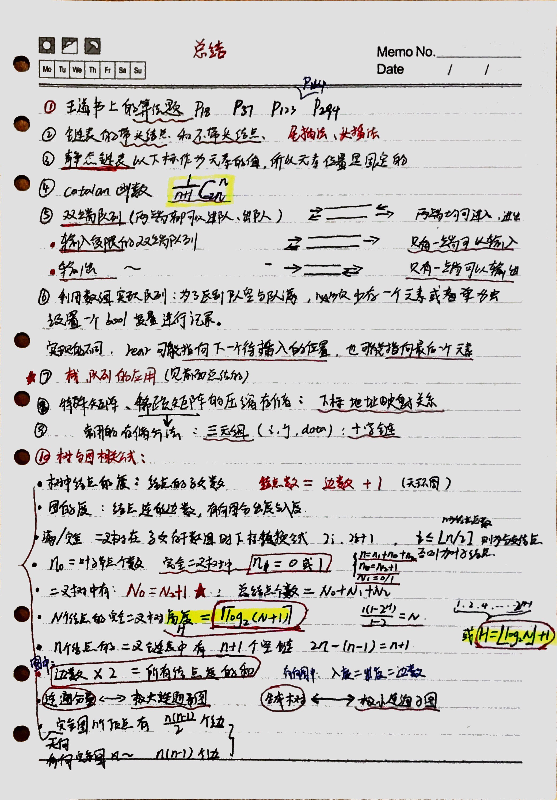

- 静态链表，通过数组实现。

<!-- 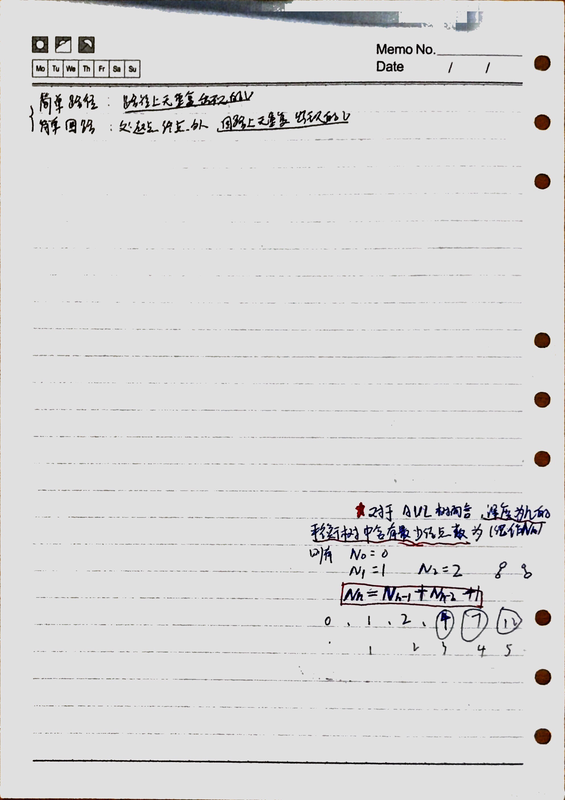 -->
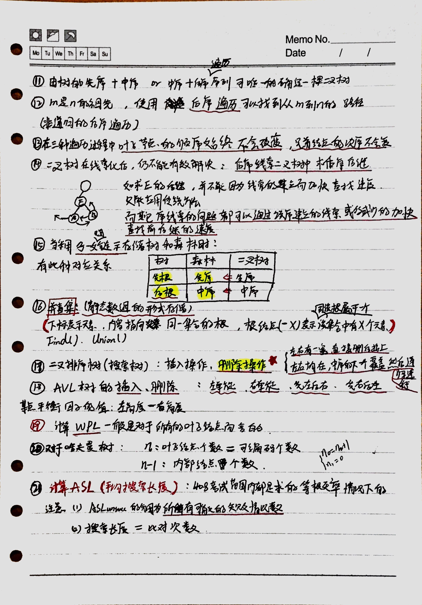

- 非递归的（基于栈实现）后序遍历，可以用来获取二叉树中，节点m到n的路径。
- 二叉树的不同遍历方法中，叶子节点和兄弟节点的访次序不会变。
- `线索二叉树`中，后序线索无法完全实现，其余均可通过添加线索，加快 prev, next 的访问。
- `子女-兄弟链` 用于表示森林。
- AVL树，有四种旋转方式来调整树的形态。
- Huffman编码：最短编码

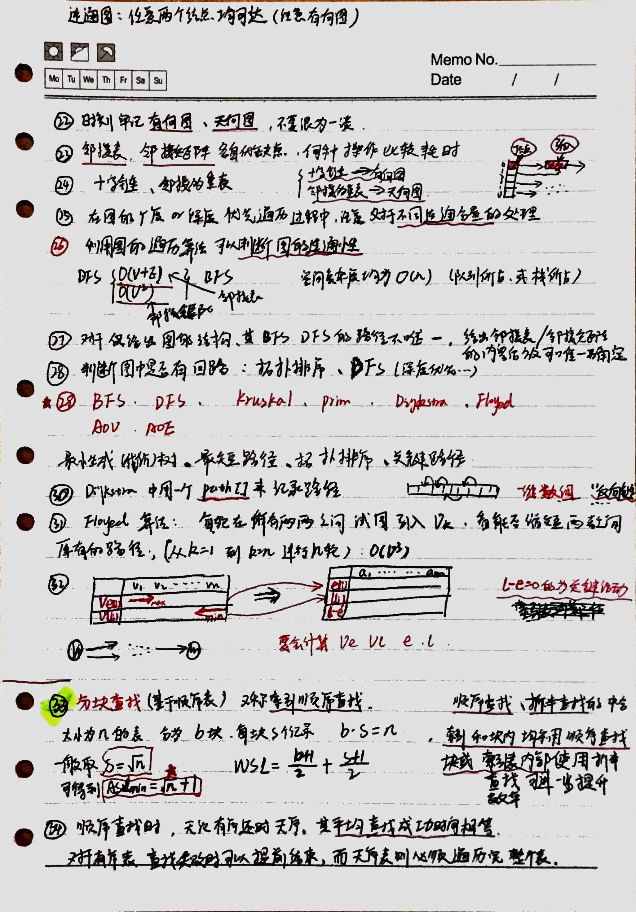

- 连通图，在图的遍历中，注意考虑非连通图不同部分的处理。通过遍历即可确定一个图是否是连通图。
- 判断图中是否有回路：`拓扑排序`，DFS遍历。

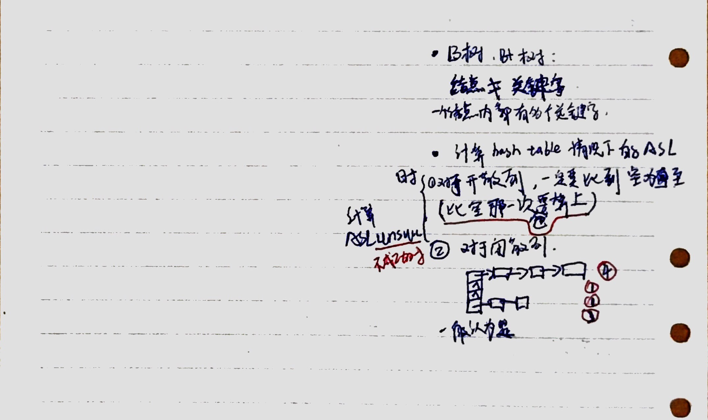

- B或B+树，节点与内部关键字是有区别的！

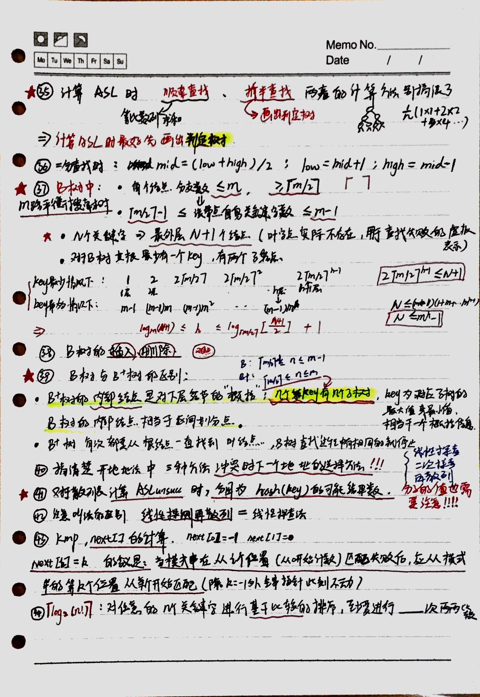
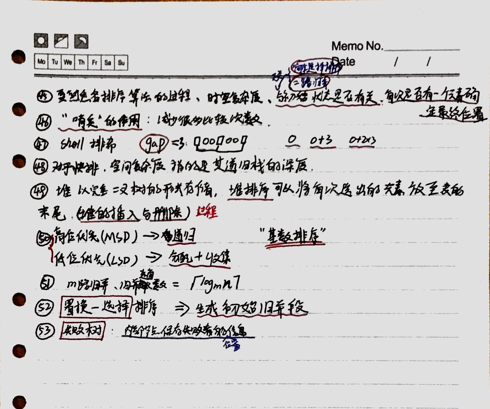

- 最大、最小堆，一般使用数组以完全二叉树的形式存储
