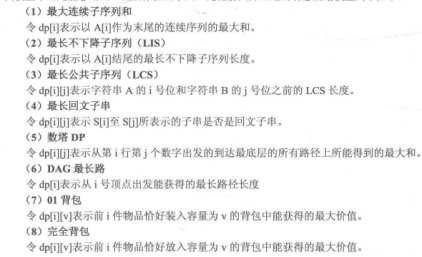

做过的算法题和一些记录的笔记
<!-- 刷过的算法题： -->
- nowcoder 牛客网 
- fudan
- PAT
- LeetCode 下的是国际站中的相关题目，lc-cn 和 lc-plug 下是中国站的题目

<!-- **主要做easy和medium的题目， hard的题目主要看下解体思路。**

leetcode之外（PAT、fudan 等中）有部分的还存在问题....没有实现或甚至编译错误。 -->

学习资源：

- 算法：https://oi-wiki.org/

- Leetcode/剑指Offer题解： https://www.cyc2018.xyz/#%E7%AE%97%E6%B3%95 

- [C++ STL笔记](./STL基础用法与注意事项.md) 

- [数据结构笔记](./408_数据结构.md)

- [maomao算法笔记](https://maomaoalgo.gitbook.io/python/) <= 按照leetcode题型进行分类，动态规划这块整理的不错

 其他：

 - OJ的输入输出的问题 [牛客网在线判题系统使用帮助](https://www.nowcoder.com/discuss/276)

# 算法题笔记
目录：
- 数据结构
  - [数组、链表](#数组链表)
  - [栈、队列](#栈队列)
  - [集合](#集合)
  - [哈希表](#哈希表)
  - [二叉树、树](#树二叉树)
  - [最大、最小堆](#最大最小堆)
- 算法
  - [递归](#递归)
  - [排序与搜索](#搜索与排序)
  - [字符串相关](#字符串相关)
  - [图相关](#图相关算法)
  - [贪心算法](#贪心算法)
  - [分治算法](#分治算法)
  - [动态规划](#动态规划)
- 其他
  - [数学](#数学)

# 数据结构：
## 数组，链表
数组：

- 滑动窗口法：
  
  滑动窗口法方法，一般用于解决**数组**或**字符串**中，**满足某类条件**的最大或最小的**连续**区间。leetcode 相关例题：

  - [最大连续1的个数3](lc-cn/最大连续1的个数3.cpp) ，[替换后的最长重复字符](lc-cn/替换后的最长重复字符.cpp)
  - [字符串中所有字母异位词](lc-cn/找到字符串中所有字母异位词.cpp)
  - [最小覆盖子串](lc-cn/最小覆盖子串.cpp)
  - [和为s的连续正数序列](lc-cn/剑指offer/和为s的连续正数序列.cpp)
  
链表：

- 删除链表中的节点时，并不一定需要知道其 prev_p 指针，直接将其值和下一个节点进行交换，然后删除下一个节点即可。前提是所删除的节点不是末尾节点！！

- 通过**快慢双指针**，一个每次走一步，另一个每次走两布。可以**确定链表的中间节点**。 👉 [链表反转 + 快慢指针](lc-cn/回文链表.cpp) 示例。
  
  快慢指针也可用于**判断链表中是否存在环**，若存在环则 fast 与 slow 肯定会在若干步之后相遇，若要确定环的入口，slow 与 fast 相遇时我们再额外使用一个指针 ptr 它指向链表头部， 它和 slow 每次向后移动一个位置，最终它们会在入环点相遇 👉[环形链表 II](https://leetcode-cn.com/problems/linked-list-cycle-ii/)。

- `双向链表` 可以很方面的检索其前后节点，插入、删除时链表的链接都很便捷。
  
## 栈，队列
递归的过程过程本质上是一系列的函数栈调用，所有的递归过程都可以通过迭代来实现。

相关题目：
- 双栈实现队列；[双队列也可实现栈](https://assets.leetcode-cn.com/solution-static/225/225_fig1.gif)，[单个队列也可实现栈](https://assets.leetcode-cn.com/solution-static/225/225_fig2.gif)

- 字符串表达式计算：中缀表达式转后缀表达式（**逆波兰表达式**）。 [例1](lc-cn/基本计算器.cpp)， [例2](lc-cn/基本计算器2.cpp)， 符号栈是否进行弹出取决于，当前操作符与栈顶操作符优先谁高，栈顶优先级高或者相等则先进行出栈和计算（相同优先级别，从左到右计算， 所以也要弹出），直到栈顶元素优先机低于当前操作符

- **`单调栈`**，是借助栈保存遍历过程中的递增、递减情况，以辅助算法的实现。 例：
  - [移掉K位数字](lc-cn/移掉%20K%20位数字.cpp)
  - [下一个更大元素I](lc-cn/下一个更大元素1.cpp)
  - [每日温度](lc-cn/每日温度.cpp)
  - [柱状图中最大的矩形](lc-cn/柱状图中最大的矩形.cpp)
  - [接雨水](lc-cn/接雨水.cpp)

  总结：**单调递减栈**，一般用来在遍历元素的过程中，找后续第一个比自身大的元素。递增栈反之~

  其他题目补充：
    - [最短无序连续子数组](lc-cn/最短无序连续子数组.cpp)

## 集合

- 并查集
  
  因为判断两个元素是否处于同一个集合的时候，通过比对两个是否拥有同样的 root。所以可以直接将集合中元素指向 root，压缩路径，以提高访问速度。

  👉 [算法学习笔记: 并查集](https://zhuanlan.zhihu.com/p/93647900)

## 哈希表
知识点：地址映射函数 + 冲突处理方法。

地址映射函数（哈希函数）：？

冲突处理方法：1）开地址发法；2）闭地址法 => 拉链法
在C++ STL 中，冲突处理方法是？

相关题目：
- [最长连续序列](lc-cn/最长连续序列.cpp)

## 树/二叉树
树的遍历：二叉树的先序、中序、后序、层次序遍历。因为树本身是一种特殊的图，因为深度、广度优先遍历的概念也存在。**二叉树的广度优先遍历 = 层次序遍历，先序遍历 = （每次先访问左子树的）深度优先遍历**。

`二叉搜索树（BST）`相关：二叉搜索树具备一些特殊的性质。

`完全二叉树`：每个节点都有左右两个子树，如果通过数组来存储完全二叉树，则每个节点的左右子节点可以通过快速计算下标获得。

`平衡二叉树`：检查二叉树是否平衡；二叉树平衡调整。

`红黑树`：红黑树着色规则？

`字典树/前缀树`：实际上就是一个26叉树，每个节点有26个节点，对应26个字符。👉[前缀树](lc-cn/前缀树.cpp)

其他：
- 给定一个先序遍历结果，求可能的后续遍历结果的可能数 = catalan 数 = C(2n,n) / (n+1)。
假设n个节点存在二叉排序树的个数是G(n)，G(n) = G(0)*G(n-1)+G(1)*(n-2)+...+G(n-1)*G(0)

值得说的题目：
- **通过迭代实现树的遍历** 👉 [通过栈迭代实现中序遍历](lc-cn/二叉搜索树中第K小的元素.cpp) 。在二叉树的三种遍历中，通过栈实现的难度排序是：**后序 > 中序 > 前序**。
- 典型的层次序遍历代码写法 👉 [二叉树层次遍历示例](lc-cn/二叉树的右视图.cpp) 。
- [二叉搜索树中，两个节点的最近公共祖先](https://leetcode-cn.com/problems/lowest-common-ancestor-of-a-binary-search-tree/)，因为是二叉搜索树，遍历找分叉节点。 **延伸题目**：[在普通二叉树中，找两个节点的公共祖先](https://leetcode-cn.com/problems/lowest-common-ancestor-of-a-binary-tree/)，通过 👉 [递归求解！](lc-cn/二叉树的最近公共祖先.cpp)
- 判断一个树是否是对称二叉树
- 给定一个整数 n，生成所有由 1 ... n 为节点所组成的 二叉搜索树 
- 二叉树的层次序遍历：借助队列实现
- 通过中序 + 后续重构一个二叉树；通过 中序 + 后续 重构一个二叉树；树中应该是不存在重复元素的 => 转化为递归建树的过程
- 树的递归遍历十分简单，但是要会通过迭代的方式完成同样的操作。例如，题目：通过迭代实现树的先序遍历 =>通过栈完成
- 将二叉树叶子节点的 null 指针进行填充，使其能够快速达到某种访问目的 =>`线索二叉树`
- 判断一个二叉搜索树的后序遍历序列是否是合法的. => [二叉搜索树的后序遍历序列](lc-cn/剑指offer/二叉搜索树的后序遍历序列.cpp)

- 二叉树的存储和加载 😭，👉 [二叉树的序列化与反序列化](lc-cn/二叉树的序列化与反序列化.cpp) 

## 最大/最小堆
最大/最小堆是优先级队列的一种实现方法.
C++中的堆
相关题目：
- 数据流中的中位数

# 算法
## 递归
斐波那契数递归实现版本的时间复杂度是O(2^n)；

递归本身不应该单独作为一个算法类别，而是很多算法的实现通过递归完成。递归的本质就是将问题划分为更小的子问题进行递归求解，把握住两点：1）子问题与原问题之间的关联；2）递归终止条件；
- [圆圈中最后剩下的数字](lc-cn/剑指offer/圆圈中最后剩下的数字.cpp)
- [不同的二叉搜索树2](lc-cn/不同的二叉搜索树II.cpp)

DFS过程本身很适合通过递归实现：
- [从字符串复原IP地址](lc-cn/复原IP地址.cpp)

这些题不会做：
- [预测赢家](lc-cn/预测赢家.cpp)

## 搜索与排序

二分查找思想：
- [有序矩阵中第K小的元素](lc-cn/有序矩阵中第K小的元素.cpp) 

排序：
- 计数排序思想：

  对公司员工按照年龄进行排序，年龄的可取值（0~99）。遍历一次统计各个年龄员工的个数，然后再遍历一遍直接将员工放在合适的位置上。时间复杂度O(n) 空间复杂度O(1)

- Top-k 排序：top-k快排中，找到第 k 个基准位置即可。👉 [数组中的第K个最大元素](lc-cn/数组中的第K个最大元素.cpp)
  
  [**哈希分支法**](https://blog.csdn.net/not_in_mountain/article/details/77963078?utm_medium=distribute.pc_relevant.none-task-blog-2%7Edefault%7EBlogCommendFromMachineLearnPai2%7Edefault-2.control&depth_1-utm_source=distribute.pc_relevant.none-task-blog-2%7Edefault%7EBlogCommendFromMachineLearnPai2%7Edefault-2.control)：海量数据中出现次数最多的前 K 个，Map-Reduce 思想。

  其他例题：[前k个高频元素](lc-cn/前k个高频元素.cpp)

- 归并排序，**归并排序分为 1）自顶部向下 2）自底向上，两种归并方法** ？实际上，两者的思路都是分治，前者是基于递归的实现过程，后者是基于迭代的实现过程。
  
  多路归并思想 👉 [有序矩阵中第K小的元素](lc-cn/有序矩阵中第K小的元素.cpp) ，[合并K个升序链表](lc-cn/合并K个升序链表.cpp)
  
- 快排实现 ： [雪糕的最大数量](lc-cn/雪糕的最大数量.cpp)

相关的题目：
- 排序的延伸，[把数组排成最小的数](lc-cn/剑指offer/把数组排成最小的数.cpp)
- 链表排序：[排序链表](lc-cn/排序链表.cpp) ； [链表插入排序](lc-cn/链表插入排序.cpp)

## 字符串相关
- 🚩字符串编辑距离
- **KMP — 字符串匹配**
  
  [如何更好地理解和掌握 KMP 算法?](https://www.zhihu.com/question/21923021)

  主要在于 next[j] 数组的计算，next[j] 表示在模式串第 j 个位置匹配失败时，应该下一步应该跳转至模式串的第几个字符。next[j] 为 0 时，主串前移一位，模式串重新从头开始匹配。

      int m = evil.size();
      fail.resize(m); // fail数组初始值均为0
      // 这是 KMP 算法的一部分，把「evil」看作模式串，得到它的 fail[] 数组
      for (int i = 1; i < m; ++i) {
            int j = fail[i - 1];
            while (j && evil[j] != evil[i]) {
                j = fail[j - 1];
            }
            if (evil[j] == evil[i]) {
                fail[i] = j + 1;
            }
        }

  `next数组的性质`：S[0] 到 S[i] 这一段子串中，前next[i]个字符与后next[i]个字符一模一样。
  
  最后得到的 fail / next 数组中的内容

      // 求 KMP 算法中的 next 数组，next数组的本质是 max_match_len 数组
      // a b a b a b
      // 0 0 1 2 3 4

      // 当 s[i] 与主串匹配失败时，应从s[ next[i - 1] ] 处接着与主串继续匹配

  相关题目：👉 [最长快乐前缀](lc-cn/最长快乐前缀.cpp)

## 图相关算法
深度优先DFS、广度优先BFS；一般深度优先遍历通过递归实现，广度优先遍历通过队列实现。广度优先一个经典的应用就是寻找最优路径。

- 通过DFS构造**排列** 👉 [字符串排列](lc-cn/剑指offer/字符串的排列.cpp)
- 基于邻接表的 DFS 遍历 👉 [传递信息](lc-cn/传递信息.cpp)

在图遍历时注意**连通域**的问题，一般遍历尝试从任意一个节点开始进行DFS或者BFS，并记录 visit 情况，这样就可以处理不同的连通域了。求图中连通域的个数：
  1) 从每一个节点尝试DFS遍历，统计能够遍历的次数 [岛屿数量](lc-cn/岛屿数量.cpp)
  2) 也可以尝试从每一个节点开始广度优先遍历
  3) 借助并查集，连通域的个数就是并查集中连通分量的数目。

最小生成树；

- [连接所有点的最小费用](lc-cn\连接所有点的最小费用.cpp)

最短路径；

## 贪心算法

## 分治算法

## 动态规划

[动态规划题型分类](https://maomaoalgo.gitbook.io/python/hui-su-yu-dong-tai-gui-hua)

💔 动态规划的核心：1）**定义问题状态**；2）**获取状态之间的转移方程，用已经计算的状态值来推算当前新的状态值**；3）求解问题时，采用 递归 或 递推（迭代） 均可。

在构建状态之间的转移方程时，如何讲**原问题进行表述**是最为关键的一步。这里列举几个例子：

合理的表述之上状态转移方程的构建则十分简单：`看 当前状态 可以转移到其它哪些状态。另一种方式是看当 前状态 可以由之前的哪些状态转移`。

- [最大连续子序列](nowcoder/最大序列和.cpp)，[环形子数组的最大和](lc-cn/环形子数组的最大和.cpp)
- [最长递增子序列](lc-cn/最长递增子序列.cpp)
  
      dp[i] = max(dp[j] + 1) , s.t. dp[i] > dp[j],  j in (0, i-1): 

- [最长公共子序列](nowcoder/最长公共子序列.cpp)，[不相交连线](lc-cn/不相交的线.cpp)
- [最长回文子串](lc-cn/最长回文子串.py)，最长回文子序列
  
  注意子串和子序列的区别，子序列不被是连续的。在**最长回文子序列**中：dp[i][j] 表示 i~j 之间的序列中的最长回文子序列。
      
      if(s[i] == s[j]): dp[i][j] = max(dp[i+1][j-1]+2, dp[i+1][j] , dp[i][j-1]);
      else:  dp[i][j] = max(dp[i+1][j] , dp[i][j-1]);
      

- 数塔dp
- 背包问题：1）01背包；2）完全背包

      // 01背包：选 i 与不选 i
      dp[i][j] = max(dp[i-1][j], dp[i-1][j-w[i]] + v[i]); 

      // 完全背包：i 物品可以被多次选择
      dp[i][j] = max(dp[i-1][j], dp[i][j-w[i]] + v[i]); 
      
      // 多重背包: 每种物品被选择的次数有限制
      dp[i][j] = max(dp[i-1][j], dp[i-1][j-k * w[i]] + k * v[i]); s.t. k in (1, limit); 
      

- `数位DP`
  
  数位dp 一般应用于：1) 求出在给定区间[A,B]内，符合条件P(i)的数i的个数. 2) **条件 P(i) 一般与数的大小无关，而与 数的组成 有关。** 
  <!-- [数位DP教程](https://leetcode-cn.com/problems/number-of-digit-one/solution/shu-wei-dp-by-weierstras/)， -->
  [数位DP教程 🚩](https://www.bilibili.com/video/BV1Fc411h76q)
  
  例题：[数字1的个数](lc-cn\数字1的个数.cpp)，[至少有1位重复的数字](lc-cn/至少有1位重复的数字.cpp)，[找到所有好字符串](lc-cn/找到所有好字符串.cpp)。

补充笔记：
- 从算法实现的角度来看动态规划的过程是一个**打表**操作，一般而言DP状态设置是两维的话（dp[i][j]）时间复杂度为O(m*n)，但是在很多问题中可以通过**滚动数字**对空间使用进行优化为O(m)或者O(n)。
- 动态规划的题目分为两大类，一种是求最优解类，典型问题是背包问题，另一种就是计数类，比如统计方案数的问题，它们都存在一定的递推性质。前者的递推性质还有一个名字，叫做 **「最优子结构」** ——即**当前问题的最优解取决于子问题的最优解**，后者类似，当前问题的方案数取决于子问题的方案数。
  

补充例题：
- 类背包思路：[点菜问题](nowcoder/点菜问题.cpp)，[最小邮票数](nowcoder/最小邮票数.cpp)，[神奇的口袋](/nowcoder/神奇的口袋.cpp)
- [最小花费](nowcoder/最小花费.cpp)
- [二叉树的最大路径和](https://leetcode-cn.com/problems/binary-tree-maximum-path-sum/)， 通过 👉 [“递归式式的动态规划”](lc-cn/二叉树最大路径和.cpp) 求解。
- [最大子矩阵（看作最大连续子序列的推广）](nowcoder/最大子矩阵.cpp)
- [最长有效括号](lc-plug/32.最长有效括号.py)
  
      方法1：
      1）用栈模拟一遍，将所有无法匹配的括号的位置全部置1，例如: ")()((())"的mark为[1, 0, 0, 1, 0, 0, 0, 0] ；
      2）经过这样的处理后, 此题就变成了寻找最长的连续的0的长度。
      实际上1）2）步骤可以合并为一个步骤，每次读取到')'时进行出栈，记录最大连续出栈个数便为结果数。
      方法2 动态规划：
      dp[i] 表示以下标 i 字符结尾的最长有效括号的长度。状态转移方程 👉[最长有效括号]

- [不同路径](lc-plug/62.不同路径.py)，[不同路径2](lc-plug/63.不同路径-ii.py)，[最小路径和](lc-plug/64.最小路径和.py)
- [不同二叉搜索树](lc-cn/不同的二叉搜索树.cpp)

      // G(n) = G(0)*G(n-1)+G(1)*(n-2)+...+G(n-1)*G(0) 
      dp[i] += dp[j - 1] * dp[i - j];

- 编辑距离！！！

这些题不会做：主要**还是不知道一道题是不是要用dp来做，以及状态如何表示** ！
- [预测赢家](lc-cn/预测赢家.cpp)
- [单词拆分](lc-cn/单词拆分.cpp)
- [恰有K根木棍可以看到的排列数目](lc-cn/恰有K根木棍可以看到的排列数目.cpp) <= 借助滚动数组进行空间优化
- [乘积最大子数组](lc-cn/乘积最大子数组.cpp)

# 其他
### 自动机
- 🚩 通过DFA（有限状态自动机）实现 [字符串转整数](https://leetcode-cn.com/problems/string-to-integer-atoi/solution/zi-fu-chuan-zhuan-huan-zheng-shu-atoi-by-leetcode-/)。

### 数学
#### 📋 位运算 
C++中的位运算操作符： 带符号左右移：`<<` 、`>>`， 与或非： `&`、 `|` 、`!` ， 异或：`^`，取反：`~`

- C++中没有（java中有）无符号左右移： `<<<` 、`>>>`。在c++中实现的方式也很简单，先将拟进行无符号右移的数转换成无符号类型，然后执行普通右移即可。

- 异或操作具有的性质：
0 ^ x = x ，x ^ x = 0. a^b = c ， a^b^b = a， 即 c^b=a 同理 c^a =b.

需要比较熟练的：
  1) 判断和统计数的二进制表示下，1 和 0 的个数

参考题目：
- [数组中数字出现的次数](lc-cn/剑指offer/数组中数字出现的次数1.cpp)
- [数组中数字出现的次数2](lc-cn/剑指offer/数组中数字出现的次数2.cpp)
- [判断一个整数是否是2的幂](https://leetcode-cn.com/problems/power-of-two/solution/2de-mi-by-leetcode-solution-rny3/) ，如果 n 是正整数并且 n & (n - 1) = 0，那么 n 就是 2 的幂。如果 n 是正整数并且 n & (-n) = n，那么 n 就是 2 的幂
  
#### 📋 大数操作
大数的 + - * /

#### 📋 快速幂

快速幂，是一个在 Θ(logn) 的时间内计算 a^n 的小技巧，而暴力的计算需要 Θ(n) 的时间。教程 👉 [快速幂思想](https://oi-wiki.org/math/quick-pow/) 。求 2^1000，可以用 快速幂+大数乘法 2^20 · 2^20 · ......

#### 📋 几何相关：
- **凸多边形判断**：一个凸多边形，保证相邻边总是单调的向顺时针或逆时针旋转。叉积的正负可以判断是否单调旋转。 => 通过相邻两边叉积（外积）来判断 👉 [link](https://www.cnblogs.com/wushuaiyi/archive/2013/12/05/3458659.html)。注意二维空间叉积的结果是一个伪向量。

- 判断点是否在三角形内（是否在多边形内）：~

#### 📋 其他相关：
- [两数相除](https://leetcode-cn.com/problems/divide-two-integers/)
- [巴什博奕](https://zhuanlan.zhihu.com/p/87826616)
- [Shuffle模拟](lc-cn/打乱数组.cpp)