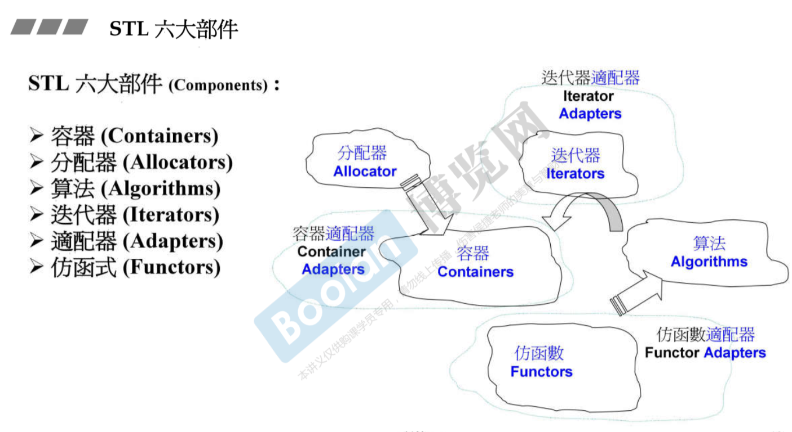
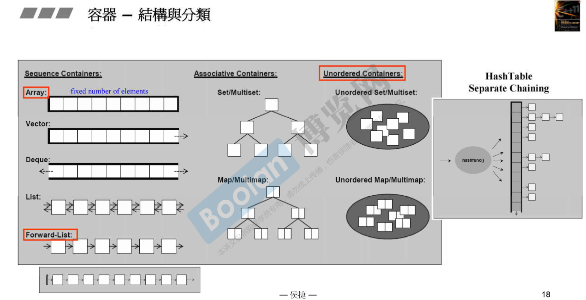

# C++ STL 的常见用法


-


## 一些问题的记录

- 容器中 size 和 capacity

  size就是实际存入数据空间的大小，capacity是容量，即能当前空间可容纳的数据个数，超过该空间大小会进行扩容（在 vector 中，容器扩容以两倍当前容量大小进行扩容）。

- vector clear 函数具体做了什么操作？什么情况下会调用类的析构函数？
  
- vector 的 push_back 做了什么操作？分几种情况？有没有分析过push_back n次平均复杂度？😀
  
  重新配置空间大小 -> 拷贝数据 -> 释放旧的空间

- STL迭代器失效情况？ 

      待补充...

- STL线程安全 ？

      待补充...


## 学习笔记
在STL中，一般而言：
- empty() 函数用于判断当前容器中是否为空, clear()一般用于清空容器中的内容。size()获取容器的当前元素个数。
- 查询函数的返回结果为迭代器类型，如果未查询到则对应end位置的迭代器。如果想要获取到迭代器对应元素的下标，在 It - begin()
- find() 一般返回结果是迭代器类型，如果没有查询到元素，则返回 container.end()， 注意 string 中的find返回的是下标。
- `swap()` 机制 
  ```C++
    template <class T> void swap (T& a, T& b)
    {
        T c(std::move(a)); a=std::move(b); b=std::move(c);
    }

    template <class T, size_t N> void swap (T &a[N], T &b[N])
    {
        for (size_t i = 0; i<N; ++i) swap (a[i],b[i]);
    }
  ```
迭代器：
- ++it 式的指针移动，在C++11中提供的 `std::next()` `std::prev()` 可以用来实现同样的功能。container.begin() + step 也同理
### 有序容器

Vector
```C++
// https://www.runoob.com/w3cnote/cpp-vector-container-analysis.html
#include <vector>
初始化：
vector<int> myVector(5); vector<int> myVector(5, 0); vector<int> myVector = { }; 
vector(begin,end);

//定义二维动态数组 N行 M列 
vector<vector<int> > obj(N, vector<int>(M)); 
obj = vector<vector<int> >(M, vector<int>(N))
traveled = new vector<vector<bool> >(M, vector<bool>(N, 0)); // M*N 的初始值均为 0 的二维数组

// 在普通数组中，int[][] dp = new int[M][N];

迭代器：
begin()/end(), rbegin()/rend(), cbegin()/cend(), crbegin()/crend()

增:
push_back() , insert() // cont.insert(cont.end(), cont1.begin(), cont2.end())

删：
pop_back(), erase(iterator pos), clear() // erase(iterator first, iterator last)

改：
myVector[i] = value

查：
front(), back(), at()
find() // 函数范围值为迭代器类型，如果没有查询到相关元素返回值为 container.end()
```
List
```C++
#include <list>
//list<int>
增:
push_back() , insert()
splice() // void splice( iterator position, list<T,Allocator>& x, iterator first, iterator last ); 将 x 中 first 到 last 的内容 截取到 当前对象中。注意，x中这部分内容会被剔除掉

删：
pop_back(), pop_front(), erase(), clear()
```
笔记：
- `[] 数组`， `array` 和 `vector` 之间的区别：
  - array vector中都对 [] 操作符进行了重载，所以都可以通过下标索引进行访问。
  - **vector 属于动态容器**，可以通过 push_back/pop_back emplace/emplace_back insert 等方法动态增删元素；**array 和 []数组 都属于固定容量容器**。
  - vector 和 array 中，包含（正反两种）迭代器遍历机制；size() empty() 函数；swap() 函数；array 中的`fill()`函数用于数组值的赋值。
    ```
    array<int, 5> temp; //构造一个大小为5的整型数组
    temp.fill(0);
    ```
  - [从功能上来看，array 可以看作是一种介于 []数组 和 vector 之间的容器](https://blog.csdn.net/acelit/article/details/68068207)。让 C++ 中的数组化身为一个容器。可以将那些vector或者map当成数组使用的方式解放出来，也可以将使用普通数组但对自己使用的过程中的安全存在质疑的代码用 array 解放出来。array 是C++11中的。
- `emplace_back()` 与 `push_back()`: 
  
  如果参数是左值，两个调用的都是copy constructor，如果参数是右值，两个调用的都是move constructor（C++ 11后push_back也支持右值）。

  最主要的区别是，emplace_back支持in-place construction，也就是说emplace_back(10, “test”)可以只调用一次constructor，而push_back(MyClass(10, “test”))必须多一次构造和析构。因此，emplace_back的最大优势是**它可以直接在vector的内存中去构建对象，不用在外面构造完了再copy或者move进去！！！**

  👉[emplace_back VS push_back](https://haoqchen.site/2020/01/17/emplace_back-vs-push_back/)

<!-- - **返回值不能为 `vector<int>&` 会造成出错** ? -->
- **函数返回值不能为 `vector<TreeNode*> &` 会造成出错** ？？？，见👉 [不同的二叉搜索树II](lc-cn/不同的二叉搜索树II.cpp)
  
  With C++11, [std::vector has move-semantics](https://stackoverflow.com/questions/15704565/efficient-way-to-return-a-stdvector-in-c), which means the local vector declared in your function will be moved on return and in some cases even the move can be elided by the compiler.

  所以vector作为返回值的函数声明上不用加 &. <= **错了！**

- `list` 和 `forward-list`，一个是双向链表，一个是单向链表。 

Queue
```C++
#include <queue>
常用方法：
增： push()
删： pop()
查： front(), back(), size(), empty()

queue头文件中priority_queue代表优先级队列,通过最大堆实现.
empty(), size()
top(), pop()
push()

#include <deque>
deque更为实用一点, 相比 queue 其支持迭代器
增：push_back(), push_front(), insert()
删：pop_back(), pop_front() // 注意 pop_ 函数的返回值为空，通过 front() 来获取
查：operator[], at(), front(), back()

```
Stack
``` C++
#include <stack>
// stack<int>
push(), emplace()
top(), pop()
size(), empty()
```
Set & Map
```C++
集合：
#include <set>

字典：
#include <map> // STL中的map就是字典，key通过hash方法进行索引
初始化： std::map<char,int> mymap; mymap['a']=101;
插入：map.insert(make_pair(key, value)); // key，value的访问，pair -> first, pair -> second
查询：map.find(key) == map.end();
count() // 指定key下是否存在元素，返回值为 0 或 1。一般用count()判断某个key是否存在
删除：
erase(key);
```

笔记：
- 在`priority_queue`中: A user-provided Compare can be supplied to change the ordering, e.g. using std::greater<T> would cause the smallest element to appear as the top().
- `priority_queue`中通过**Compare模板**控制大小比较的过程，从而实现最小堆
  ```C++
  priority_queue<int> lo; // max heap
  priority_queue<int, vector<int>, greater<int>> hi;   // min heap
  ```
- `set`和`multiset` 属于有序容器。不同的是后者允许存在重复元素，而前者不允许。通常使用平衡二叉树实现，实际上set和multiset通常以红黑树实现。具有对数搜索时间复杂度，但是不能直接改变元素值，因为这样会打乱原有的顺序。改变元素值的方法是：先删除旧元素，再插入新元素。


### 无序容器
```C++
#include <unorder_set> //元素位置基于hash值决定
常用方法（与STL其他容器的使用方法类似）：insert(), erase(), find(),

#include <unorder_map> // key-value

哈希表：数据的查询时间为 O(1) ， 最坏情况下为 O(n). unordered_set 和 unordered_map 的操作方式都和普通的 set 和 map 类似。这两者的只有正向迭代方法 begin()/cbegin()。在内部，unordered_set 中的元素未按任何特定顺序排序，而是根据它们的哈希值组织为存储桶，以允许直接通过它们的值快速访问各个元素（平均具有常数平均时间复杂度）。
```
笔记：
- [`map` 和 `unorder_map` 的区别](https://blog.csdn.net/qq_21997625/article/details/84672775)： map 基于`红黑树`实现，unordered_map 基于`哈希表`实现（冲突处理的方法是拉链法，所以一个hash key下可以有多个元素）。

    红黑树的每一个节点都代表着 map 的一个元素。因此，对于map进行的查找，删除，添加等一系列的操作都相当于是对红黑树进行的操作。map中的元素是按照二叉搜索树存储的，使用中序遍历可将键值按照从小到大遍历出来。因此对于对于有顺序性需求的情况而言，map 会更加适用。但是由于树的存储、构建和调整会产生额外的开销。红黑树的搜索、插入、删除时间复杂度均为 O(logN)

    unordered_map 内部实现了一个哈希表，其元素的排列顺序是无序的。查找速度通常为 O(1)。对于unordered_map或unordered_set 容器，其遍历顺序与创建该容器时输入的顺序不一定相同，因为遍历是按照哈希表从前往后依次遍历的。

    unordered_map 的用法和 map 是一样的，提供了 insert，size，count等操作，并且**里面的元素也是以pair类型来存贮**的。层实现是完全不同的，就外部使用来说却是一致的。

    `set` 和 `unordered_set` 的的区别也是如此。前者基于红黑树实现，后者基于哈希表实现。
- **注意**：unordered_set/map 是基于哈希表并通过拉链法来处理hash冲突问题，但不要误解为同一个 key 下可以取出多个值来，冲突处理是在说hash(key)相同的情况。key 和 value 是一一对应的，可以将value设置为vector类型对象。
- `关联式容器` 概念： map、multimap、set 以及 multiset 这 4 种容器。与序列式容器不同，关联式容器中的每个元素会对应一个key键，整体以键值对的方式存储到容器中。相比序列式容器，关联式容器可以通过键值直接找到对应的元素，而无需遍历整个容器。另外，关联式容器在存储元素时默认会根据各元素键值的大小做升序排序（可以通过 operator< 和 operator== 来自定义比较行为）。

相比其它类型容器，关联式容器查找、访问、插入和删除指定元素的效率更高。
### algorithm
- 排序 `sort()`
- 最大、最小值 `min_element()`
- 逆序 `reverse()`
```C++
#include <cmath>
// absf(); asin(); sin();
// fill(); max(); min(); abs();


#include <algorithm>

排序：
sort(myvector.begin(), myvector.begin()+4); 
bool myfunction (int i,int j) { return (i < j); }
sort(myvector.begin(), myvector.end(), compFunc); // 升序排序

容器搜索：
获取容器中最大值最小值：
/**
template <class ForwardIterator>
ForwardIterator max_element (ForwardIterator first, ForwardIterator last);

template <class ForwardIterator, class Compare>
ForwardIterator max_element (ForwardIterator first, ForwardIterator last,
                            Compare comp);
 * **/
*std::min_element(myints,myints+7); // 最小值
max_element()
自定义比较函数：


// reverse(); 

//make_heap(vector.begin(), vector.end()), 
//pop_heap(..., ...);

其他常用：
std::accmulate(wall[0].begin(), wall[0].end(), 0); // 累加函数
```
笔记:
- STL在 algorithm 中实现了对存储在数组或vector中的元素进行堆操作的函数，包括 `make_heap` 建堆, `pop_heap` 堆中弹出, `push_heap` 堆中插入, 以及 `sort_heap` 堆排序，即**用数组或vector数据容器来实现堆**。默认情况下是max-heap，该堆实际上是以一个vector表现的完全二叉树。更为便捷的方法是使用 `prior_queue` 其内部对应一个最大堆.

## C++中常用的头文件库&相应的函数
### 输出、输出
```C++
#include <iostream>
#include <cstdio>
//printf()
#include <sstream>
//ostringstream os; os << num; os.srt();
#include <iomanip>
//cout << fixed << setpercision(2)
```

### 字符串
在C++ <string> 类库中，一般与位置相关的函数的参数或返回值类型是 size_t 类型（不是STL中的迭代器哈~~），指明所处 string 中的位置。
```C++
// http://c.biancheng.net/view/400.html
#include <string>
初始化：

常用方法：
size()
find(" ", start_pos), // string::npos; 
string 类有一些查找子串和字符的成员函数，它们的返回值都是子串或字符在 string 对象字符串中的位置（即下标）。如果查不到，则返回 string::npos。
substr(int a, int b); // 字符串截取
replace(size_t pos, size_t len ...) // 替换
erase() // Erases part of the string

剔除字符串中的空格
    auto p = str.find(' ');
    while(p != string::npos){
        str.replace(p, 1, "");
        p = str.find(' ');
    }

字符串按照空格划分
    vector<string> sub_strs;
	int start_p = 0;
	int end_p = str.find(' ', 0);
	while (end_p != string::npos) {
		string sub_str(str, p, end_p - start_p + 1); // pos, len
		if(sub_str != " ") sub_strs.push_back(sub_str);
		start_p = end_p + 1; // 新的起点
		end_p = str.find(' ', start_p);
	}


其他数值类型 <=>字符串
std::to_string() // C++11中新增的函数，将整数、浮点数转化为 string 对象
std::atoi(const char* str); // string::c_str() 将 string 类型转化为 C 风格的 char*
// atol() atof() strtol()

#include <cstring>
// strtok();

#define _MAX 21e+8
#define _MIN -21e+8
```
`<sstream>` 中定义了三个类：`istringstream` 、`ostringstream` 和 `stringstream`，分别用来进行**流的输入**、**输出**和**输入输出操作**。

与 iostream 类似，`<<` 表示写入流中 `>>` 表示从流中读取

```C++
stringstream

str(); // 将流中内容转为 string
clear(); // 清空当前流中的内容

字符串按照空格划分

    string str;
    istringstream strcin(str);
    string s;
    vector<string> vs;
    while(strcin >> s) vs.push_back(s);


字符串转整形
    stringstream sstream;
    int num;
    // 插入字符串
    sstream << "456";
    // 转换为int类型
    sstream >> num;

```
## 常见的使用错误
- C++11 中增添了foreach的特性，注意要对遍历元素的值进行修改需要是对元素的引用或者指针。
- STL deque容器中的 pop_front() pop_back() 范围值为void, 通过 front() 和 back() 来访问值
- 声明多个相同类型的指针时，正确的声明方式是：`TreeNode *p_x, *p_y;` 而不是 `TreeNode* p_x, p_y ;` !!!! 
- `INT_MAX` `INT_MIN` 在标准头文件limits.h中定义 
    ```C++
    #define INT_MAX 2147483647 // 2^31
    #define INT_MIN (-INT_MAX - 1)
    ```
- C++ STL中 map 和 unordered_map 之间的区别？ map 在内部实现上实际上是一种有序容器